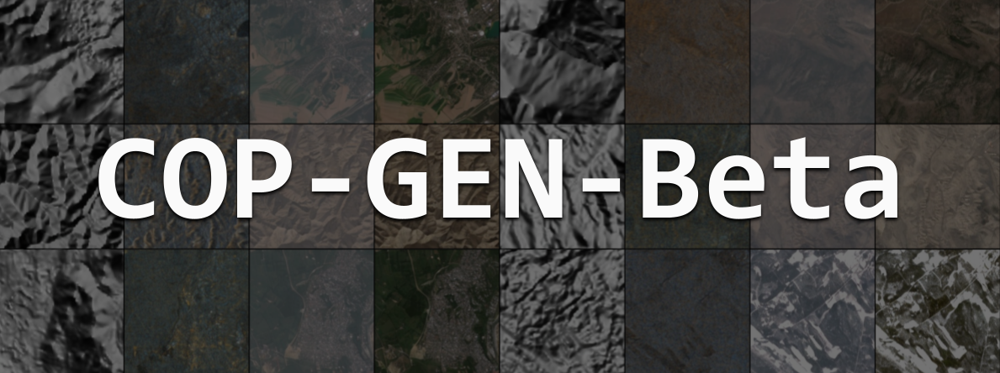
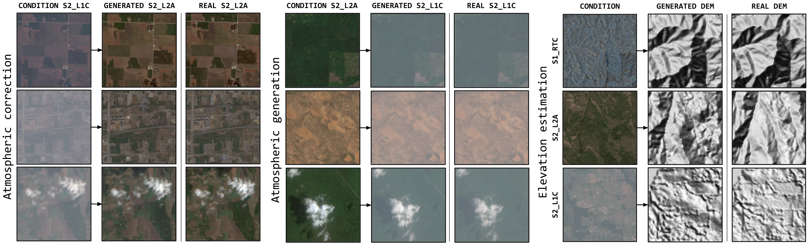

# [CVPRW 2025] 🌍 COP-GEN-Beta: Unified Generative Modelling of COPernicus Imagery Thumbnails

[](https://huggingface.co/spaces/mikonvergence/COP-GEN-Beta)
[](https://github.com/miquel-espinosa/COP-GEN-Beta)
[](https://miquel-espinosa.github.io/cop-gen-beta/)
[](https://huggingface.co/mespinosami/COP-GEN-Beta)
[](https://www.arxiv.org/abs/2504.08548)
<a href="https://colab.research.google.com/github/miquel-espinosa/COP-GEN-Beta/blob/main/COP_GEN_Beta_inference.ipynb" target="_parent"></a>

This repository contains the official implementation of our paper:

[COP-GEN-Beta: Unified Generative Modelling of COPernicus Imagery Thumbnails,
*Miguel Espinosa*, *Valerio Marsocci*, *Yuru Jia*, *Elliot J. Crowley*, *Mikolaj Czerkawski*, CVPRW 2025](https://www.arxiv.org/pdf/2504.08548)

### Abstract
> _In remote sensing, multi-modal data from various sensors capturing the same scene_
_offers rich opportunities, but learning a unified representation across these modalities remains a significant challenge._
_Traditional methods have often been limited to single or dual-modality approaches._
_In this paper, we introduce COP-GEN-Beta, a generative diffusion model trained on optical, radar, and elevation data from the Major TOM dataset._
_What sets COP-GEN-Beta apart is its ability to map any subset of modalities to any other, enabling zero-shot modality translation after training._
_This is achieved through a sequence-based diffusion transformer, where each modality is controlled by its own timestep embedding._
_We extensively evaluate COP-GEN-Beta on thumbnail images from the Major TOM dataset, demonstrating its effectiveness in generating high-quality samples._
_Qualitative and quantitative evaluations validate the model's performance, highlighting its potential as a powerful pre-trained model for future remote sensing tasks._

<!-- <details> -->
<!-- <summary><h3><b>Table of Contents</b></h3></summary> -->

### Table of Contents
- [Architecture Overview](#cop-gen-beta-architecture-overview)
- [Training Code Instructions](#training-code-instructions)
  - [0. Basic folder setup](#0-basic-folder-setup)
  - [1. Download training data](#1-download-training-data-subset-example-rome)
  - [2. Patchify and encode thumbnails](#2-patchify-and-encode-thumbnails)
  - [3. Pre-compute features with Stable Diffusion](#3-pre-compute-features-with-stable-diffusion-pretrained-autoencoder)
  - [4. Convert dataset to LMDB (optional)](#4-convert-dataset-to-lmdb-optional)
  - [5. Train the model](#5-train-the-model)
- [Inference Instructions](#cop-gen-beta-inference-instructions)
  - [1. Download model checkpoint](#1-download-model-checkpoint)
  - [2. Run inference on test set](#2-run-inference-on-test-set-rome-subset)
    - [Example 1: Unconditional generation](#example-1-unconditional-generation)
    - [Example 2: Single modality conditioning](#example-2-single-modality-conditioning)
    - [Example 3: 2 modality conditioning](#example-3-2-modality-conditioning)
    - [Example 4: 3 modality conditioning](#example-4-3-modality-conditioning)

<!-- </details> -->

# COP-GEN-Beta: Architecture Overview

We introduce COP-GEN-Beta, a diffusion model designed to handle multiple remote sensing modalities. Specifically, COP-GEN-Beta operates on four key EO modalities: Digital Elevation Model (DEM), Sentinel-1 Radar Terrain Corrected (S1 RTC), Sentinel-2 Level 1C (S2 L1C), and Sentinel-2 Level 2A (S2 L2A). Unlike previous approaches, which require separate models for per modality, COP-GEN-Beta learns joint, conditional, and marginal distributions within a unified framework.

This is achieved by (a) sampling a global and dense dataset of these modalities from Major TOM, encoding all images with a pretrained StableDiffusion autoencoder, and (b) training a sequence-based denoising diffusion model using a transformer backbone, where each modality is supplied with its designated timestep. This approach makes it possible to (c) generate all modalities based on any subset thereof that is available.


# COP-GEN-Beta: Results

COP-GEN-Beta's flexible sampling capabilities enable a wide range of downstream applications
through various modality translation combinations. By allowing generation of any subset of
modalities conditioned on any other subset, our model unlocks numerous practical use cases in
remote sensing, from atmospheric correction and DEM generation to dataset expansion.




# COP-GEN-Beta: Training code instructions.

## 0. Basic folder setup

Data will be stored in `./data/`. Create a symlink if you need.

```bash
ln -s /path/to/disk/with/storage/ ./data
```

Download stable diffusion model weights.

```bash
mkdir -p ./assets/stable-diffusion
```

Download from [here](https://drive.google.com/drive/folders/1sV-IvcGUrZeIlTmtuKv9vDJiB4JEHL-f) and place in `./assets/stable-diffusion`.


## 1. Download training data (subset example: Rome)

Select a subset of data to download for training. For example, lets download the region of Rome.

```bash
sh scripts/download_rome.sh
```

Run `python3 scripts/download_world.py --help` to see the available options.

The folder structure generated will look like this:
```
data/majorTOM
    ├── Core-DEM
    │   ├── metadata.parquet
    ├── Core-S1RTC
    │   ├── metadata.parquet
    ├── Core-S2L1C
    │   ├── metadata.parquet
    ├── Core-S2L2A
    │   ├── metadata.parquet
    ├── rome
    │   ├── Core-DEM
    │   │   ├── metadata.parquet (metadata.parquet for rome subset)
    │   │   ├── <grid_cell>
    │   │   │   ├── ...
    |   │   │   ├── compressed.tif
    |   │   │   ├── DEM.tif 
    |   │   │   └── thumbnail.png
    │   ├── Core-S1RTC
    │   │   ├── metadata.parquet (metadata.parquet for rome subset)
    │   │   ├── <grid_cell>
    │   │   │   ├── ...
    │   │   │   ├── vh.tif
    │   │   │   ├── vv.tif
    │   │   │   ├── thumbnail.png
```

## 2. Patchify and encode thumbnails.

Align image modalities (find common grid_cells), patchify into 256x256 patches (thumbnails are 1068x1068, we first crop to 1024x1024, then patchify), create train/test splits.

```bash
# export PYTHONPATH=$(pwd) # Run if encoutering error: ModuleNotFoundError: No module named 'libs' 
python3 prepare_dataset_images.py --subset_path data/majorTOM/rome --output_dir data/majorTOM/rome/rome_thumbnail_png --bands thumbnail
```

## 3. Pre-compute features with Stable Diffusion pretrained autoencoder.

```bash
bands=(DEM_thumbnail S1RTC_thumbnail S2L1C_thumbnail S2L2A_thumbnail)
splits=(train test)
for band in "${bands[@]}"; do
    for split in "${splits[@]}"; do
        python3 encode_majortom_images.py \
            --path "data/majorTOM/rome/rome_thumbnail_png/${split}/${band}" \
            --resolution 256 \
            --output_dir "data/majorTOM/rome/rome_thumbnail_npy/${split}/${band}"
    done
done
```

Folder structure generated for the command above:
```
data/majorTOM/rome/

├── train
│   ├── DEM_thumbnail
│   │   ├── 0.npy
│   │   ├── 1.npy
│   │   ├── ...
│   ├── S1RTC_thumbnail
│   │   ├── 0.npy
│   │   ├── 1.npy
│   │   ├── ...
│   ├── S2L1C_thumbnail
│   │   ├── 0.npy
│   │   ├── 1.npy
│   │   ├── ...
│   ├── S2L2A_thumbnail
│   │   ├── 0.npy
│   │   ├── 1.npy
│   │   ├── ...
├── test
│   ├── DEM_thumbnail
│   │   ├── 0.npy
│   │   ├── 1.npy
│   │   ├── ...
```
## 4. Convert dataset to LMDB (optional).

Convert npy files to LMDB dataset, for both train and test splits. (Update --batch-size to a lower value if it doesn't work).

```bash
python3 create_lmdb.py \
    --input-img-dir data/majorTOM/rome/rome_thumbnail_npy/train \
    --output-dir data/majorTOM/rome/rome_thumbnail_npy_lmdb/train \
    --input-type npy

python3 create_lmdb.py \
    --input-img-dir data/majorTOM/rome/rome_thumbnail_npy/test \
    --output-dir data/majorTOM/rome/rome_thumbnail_npy_lmdb/test \
    --input-type npy
```

## 5. Train the model

Train the model using the following command (2 GPUs, 4 modalities). Adjust the number of GPUs and the config file as needed.

NOTE on the config file:
- Since we are training on a toy dataset, we set the batch size to 8. Feel free to increase it for larger datasets.
- Logging frequency, eval frequency, and save frequency are set to 2 for faster logging. Feel free to increase it for larger datasets.

Visual results, checkpoints, and logs are stored in a generated folder called `workdir`.

### Training with LMDB dataset

```bash
export NUM_GPUS=2
accelerate launch \
            --multi_gpu \
            --num_processes $NUM_GPUS \
            --mixed_precision fp16 \
            train_triffuser_discrete.py \
                --config="configs/majortom/discrete/lmdb/rome_dems1s2s2_cop_gen_beta.py"
```

### Training without LMDB (tuples dataset)

```bash
export NUM_GPUS=2
accelerate launch \
            --multi_gpu \
            --num_processes $NUM_GPUS \
            --mixed_precision fp16 \
            train_triffuser_discrete.py \
                --config="configs/majortom/discrete/rome_dems1s2s2_cop_gen_beta.py"
```


# COP-GEN-Beta: Inference instructions.

COP-GEN-Beta is characterized by its great versatility when generating images.
Given 4 modalities (DEM, S1RTC, S2L1C, S2L2A), there exist the following generation options:

- **Unconditional generation:** Generates tuples of 4 modalities without any condition.
- **Conditional generation:**
    - **Single modality conditioning:** Generates missing modalities conditioned on a single modality.
    - **2 modality conditioning:** Generates missing modalities conditioned on 2 modalities.
    - **3 modality conditioning:** Generates missing modalities conditioned on 3 modalities.

## 1. Download model checkpoint

<!-- To upload the model to Hugging Face Hub just run in the pth folder: -->
<!-- huggingface-cli upload mespinosami/COP-GEN-Beta . -->

Download the model ema checkpoint from Hugging Face (https://huggingface.co/mespinosami/COP-GEN-Beta) [download-link](https://huggingface.co/mespinosami/COP-GEN-Beta/resolve/main/nnet_ema_114000.pth) and place it in `./models` folder.

This can be done by running:
```bash
mkdir -p models
wget https://huggingface.co/mespinosami/COP-GEN-Beta/resolve/main/nnet_ema_114000.pth -O models/nnet_ema_114000.pth
```

## 2. Run inference on test set (Rome subset)

To see all the available inference options, run `python3 sample_n_triffuser.py --help`.
For instance:
- `--n_samples` controls the number of samples to generate for the same input condition
(useful to evaluate the generation variability),
- `--generate` is the list (comma separated) of modalities to generate,
- `--condition` is the list (comma separated) of modalities to condition on,


### Example 1: Unconditional generation

Generates all modalities (DEM, S1RTC, S2L2A, S2L1C).
```bash
python3 sample_n_triffuser.py \
    --config configs/majortom/discrete/lmdb/rome_dems1s2s2_cop_gen_beta.py \
    --data_path data/majorTOM/rome/rome_thumbnail_npy_lmdb/test \
    --data_type lmdb \
    --nnet_path models/nnet_ema_114000.pth \
    --n_mod 4 \
    --generate dem,s1_rtc,s2_l2a,s2_l1c \
    --output_path out_images \
    --n_samples 4 \
    --save_as grid
```

### Example 2: Single modality conditioning

Conditioning on S1RTC to generate DEM, S2L2A, and S2L1C.

```bash
python3 sample_n_triffuser.py \
    --config configs/majortom/discrete/lmdb/rome_dems1s2s2_cop_gen_beta.py \
    --data_path data/majorTOM/rome/rome_thumbnail_npy_lmdb/test \
    --data_type lmdb \
    --nnet_path models/nnet_ema_114000.pth \
    --n_mod 4 \
    --condition s1_rtc \
    --generate dem,s2_l2a,s2_l1c \
    --output_path out_images \
    --n_samples 4 \
    --save_as grid
```

### Example 3: 2 modality conditioning

Conditioning on DEM and S1RTC to generate S2L2A and S2L1C.

```bash
python3 sample_n_triffuser.py \
    --config configs/majortom/discrete/lmdb/rome_dems1s2s2_cop_gen_beta.py \
    --data_path data/majorTOM/rome/rome_thumbnail_npy_lmdb/test \
    --data_type lmdb \
    --nnet_path models/nnet_ema_114000.pth \
    --n_mod 4 \
    --condition dem,s1_rtc \
    --generate s2_l2a,s2_l1c \
    --output_path out_images \
    --n_samples 4 \
    --save_as grid
```

### Example 4: 3 modality conditioning 

Conditioning on DEM, S1RTC, and S2L2A to generate S2L1C.

```bash
python3 sample_n_triffuser.py \
    --config configs/majortom/discrete/lmdb/rome_dems1s2s2_cop_gen_beta.py \
    --data_path data/majorTOM/rome/rome_thumbnail_npy_lmdb/test \
    --data_type lmdb \
    --nnet_path models/nnet_ema_114000.pth \
    --n_mod 4 \
    --condition dem,s1_rtc,s2_l2a \
    --generate s2_l1c \
    --output_path out_images \
    --n_samples 4 \
    --save_as grid
```

# Citation

If you find this work useful, please cite it as follows:

```bibtex
@inproceedings{espinosa2025copgenbeta,
  title={COP-GEN-Beta: Unified Generative Modelling of COPernicus Imagery Thumbnails},
  author={Espinosa, Miguel and Marsocci, Valerio and Jia, Yuru and Crowley, Elliot J. and Czerkawski, Mikolaj},
  booktitle={CVPRW},
  year={2025}
}
```
